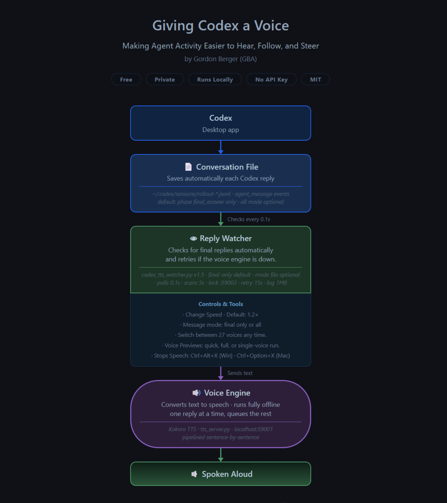

<p align="center">
  
</p>

<div align="center">

# Omnicapable Voice for Codex

   

[Install](#install) · [How it works](#how-it-works) · [Controls](#controls) · [Uninstall](#uninstall)

</div>

Each final assistant reply is read aloud automatically. A watcher reads Codex's session files on disk, so nothing is copied or pasted and nothing leaves your machine.

> **Part of Omnicapable:** Omnicapable bridges AI activity and human agency, making machine behavior easier to see, hear, follow, and steer. See also: [Claude Code](https://github.com/Omnicapable/claude-code-tts) · [Claude Cowork](https://github.com/Omnicapable/claude-cowork-tts).
>
> **Not affiliated.** An independent, open-source Omnicapable project, not affiliated with or endorsed by OpenAI. The Codex name is used only to indicate compatibility.

---

## What makes this different

This is not a generic text-to-speech add-on. It is built for coding agents:

- **Built for agents, not bolted on.** A watcher reads each final reply straight from Codex's session files, so it is spoken automatically. No copy-paste, no reading your screen.

- **Tuned for agent output.** By default it reads only Codex's final answers, unchanged, and skips what doesn't belong in speech, like code blocks, tables, URLs, and emoji. You hear the point, not the syntax.

- **Local, private, and free.** Everything runs offline with the open Kokoro model. No API keys, no accounts, no cloud, no cost.

- **Shared engine across your agents.** Claude Code, Claude Cowork, and Codex install separately but share one local voice engine and controls, so each new one reuses what's already there and behaves the same.

- **Keeps you in the loop.** Hear what your agent is doing and guide it while your eyes are elsewhere. It runs in the background, so it never slows your agent down.

- **Yours to tune.** 27 voices and adjustable speed, with a per-tool voice so parallel agents sound distinct.

- **More accessible.** A comfortable way to work with AI for people with dyslexia, low vision, or screen fatigue.

---

## Requirements

- Windows 10/11 or macOS 12+
- Python 3.9+
- Codex installed and writing session rollout files under `~/.codex/sessions`

---

## Install

Setup takes just a few clicks and configures everything for you automatically.

**Let your agent do it.** Just paste this into Codex:

```
Clone https://github.com/Omnicapable/codex-tts and run the installer for my operating system.
```

It clones and installs everything for you.

**Prefer to do it yourself?** Clone the repo, then:

**Windows:** right-click `Windows/install_codex_tts_Windows.ps1` and choose *Run with PowerShell* (no admin needed).

**macOS:** run in Terminal:
```bash
chmod +x Mac/install_codex_tts_Mac.sh && ./Mac/install_codex_tts_Mac.sh
```

The installer sets up everything for you automatically (one time, mostly a model download):
1. Installs Python packages (`kokoro-onnx`, `sounddevice`, `numpy`)
2. Downloads the Kokoro model (~336 MB, one time, skipped if already present)
3. Writes the watcher script
4. Sets up auto-start (Windows: scheduled task watchdog; macOS: launchd)
5. Launches the server and watcher immediately

---

## How it works

A watcher process monitors `~/.codex/sessions/rollout-*.jsonl`, the files the Codex CLI writes as the agent runs, and sends final assistant replies to the [Kokoro ONNX](https://github.com/thewh1teagle/kokoro-onnx) server as they arrive. Codex also writes interim commentary and status updates to the same rollout files; Codex TTS filters those out by default so it behaves like the quieter Claude TTS setups. Kokoro runs fully on CPU, no GPU required.

<p align="center">
  
</p>

Port layout:

| Port | Protocol | Purpose |
|------|----------|---------|
| 59001 | TCP | Kokoro TTS server, shared by all TTS watchers |
| 59002 | UDP | Claude Cowork TTS single-instance lock |
| 59003 | UDP | Codex TTS single-instance lock (this watcher) |

---

## Shared toggle

TTS is on by default. Toggle it without restarting anything:
```cmd
echo on  > "%USERPROFILE%\.claude\tts_enabled.txt"
echo off > "%USERPROFILE%\.claude\tts_enabled.txt"
```
This toggle is shared with Claude Code TTS and Claude Cowork TTS if you have those installed. One file controls all of them.

---

## Message mode

Codex TTS speaks final replies only by default. This skips Codex `commentary` status updates and reads only rollout messages with `phase: "final_answer"`.
```cmd
echo final > "%USERPROFILE%\.claude\codex_tts_message_mode.txt"
echo all   > "%USERPROFILE%\.claude\codex_tts_message_mode.txt"
```
`final` is recommended for normal use. `all` is useful only if you also want to hear Codex's interim working updates.

Windows helper scripts are included:
```cmd
Windows\set_codex_tts_final_only.bat
Windows\set_codex_tts_all_messages.bat
```

---

## Controls

Type an instruction to Codex, or run the scripts yourself. See also [Shared toggle](#shared-toggle) and [Message mode](#message-mode) above.

| Action | Command |
| --- | --- |
| Change voice | `set_voice.py <voice>` |
| Change speed (0.5 to 2.5) | `set_speed.py --up` / `--down` / `1.5` |
| Stop current speech | `Ctrl+Alt+X` (Windows) / `Ctrl+Option+X` (macOS) |

Voice and speed scripts live in `%USERPROFILE%\.claude\kokoro\`. The stop hotkey works globally from any window; on macOS, grant Accessibility permission when prompted (System Settings, Privacy and Security, Accessibility).

<details>
<summary><b>All 27 voices and previews</b></summary>

- American male: `am_onyx` (default), `am_adam`, `am_echo`, `am_eric`, `am_fenrir`, `am_liam`, `am_michael`, `am_santa`
- American female: `af_alloy`, `af_aoede`, `af_bella`, `af_heart`, `af_jessica`, `af_kore`, `af_nicole`, `af_nova`, `af_river`, `af_sarah`, `af_sky`
- British female: `bf_alice`, `bf_emma`, `bf_isabella`, `bf_lily`
- British male: `bm_daniel`, `bm_fable`, `bm_george`, `bm_lewis`

Preview voices by typing an exact phrase in Codex (`quick voices`, `test voices`, `preview all voices`, `try onyx`, `play voice echo`), or run the helper directly:

```cmd
py -3 "%USERPROFILE%\.claude\kokoro\tts_preview.py" "quick preview voices"
```

Short aliases work when unique (`onyx` becomes `am_onyx`, `sky` becomes `af_sky`), along with common typo and phonetic aliases (for example `onix`, `erik`, `micheal`, `skye`, `sara`, `lilly`, `jorge`, `louis`, and `eco`/`eko`/`ecko`/`ekko` for `am_echo`). Ordinary explanatory text is ignored.

</details>

<details>
<summary><b>Give Codex its own voice</b></summary>

So it sounds different from other TTS setups running at the same time:

```python
# In codex_tts_watcher.py, change:
WATCHER_VOICE = None
# to, for example:
WATCHER_VOICE = "am_adam"
```

</details>

<details>
<summary><b>What gets spoken (text cleaning rules)</b></summary>

The shared Kokoro server cleans the text before synthesising. These are silently skipped or replaced:

- **Code blocks** are removed entirely; only the surrounding explanation is read.
- **Markdown tables** are replaced with "attached table".
- **URLs** are replaced with "link".
- **Emoji** are stripped.
- **Abbreviations** are expanded - `e.g.` becomes "for example", `vs.` becomes "versus", and `$50` becomes "50 dollars".

</details>

---

## Log file

| File | Purpose |
|------|---------|
| `~\.codex\tts\codex_tts_watcher_log.txt` | Startup, tracked files, speech events |

Logs rotate automatically at 1 MB (`.prev` keeps the previous file).

---

## Uninstall

1. Delete `%USERPROFILE%\.codex\tts\`
2. Remove the Codex TTS Watchdog scheduled task:
   ```
   schtasks /delete /tn "Codex TTS Watchdog"
   ```
3. Optionally delete `%USERPROFILE%\.claude\kokoro\` if you do not use Claude Code TTS.

---

## Credits

Built on the open [Kokoro ONNX](https://github.com/thewh1teagle/kokoro-onnx) text-to-speech model, which runs fully offline on CPU.

Created by [Gordon Berger](https://github.com/GordonBerger), part of [Omnicapable](https://github.com/Omnicapable).

---

## License

MIT License. See [LICENSE](LICENSE) for details.
